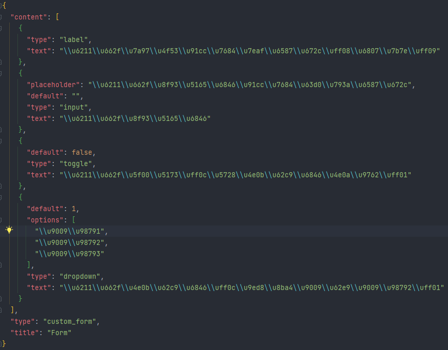
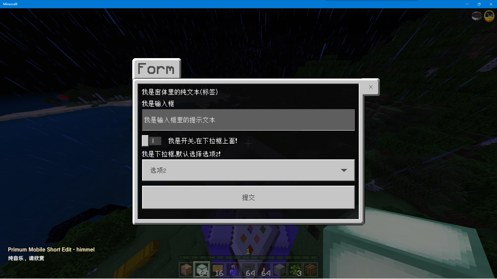

# BDSPyPluginDevHelper

Version: 0.0.1

Author: [student_2333](https://github.com/lgc2333)

插件需求
--

- 无

插件介绍
--
本插件旨在帮助开发者更便捷地进行PYR插件开发

- [FormHelper](./devhelper/form_helper.py)：帮助开发者更高效地构建GUI窗体

  一定程度上借鉴 [PyrHelper](https://www.minebbs.com/resources/bds-pyrhelper-gui-_-_.3030/)

  简单示例：
  ```python
  from devhelper import form_helper

  form = form_helper.Form()
  form.add_label('我是窗体里的纯文本（标签）')
  form.add_input('我是输入框', '我是输入框里的提示文本')
  form.add_dropdown('我是下拉框，默认选择选项2！', ['选项1', '选项2', '选项3'], 1)
  form.add_toggle('我是开关，在下拉框上面！', insert_pos=2)
  player.sendCustomForm(str(form), lambda _, __: None)
  ```
  `str(form)`输出（格式化后）：

  

  效果：

  

- 其余请期待后续更新

安装方法
--

- 将 `devhelper` 文件夹放入 `BDS根目录/plugins/py` 文件夹内

更新日志
--
2022.2.6 更新0.0.1测试版