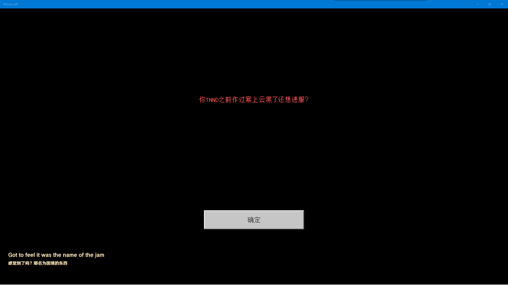
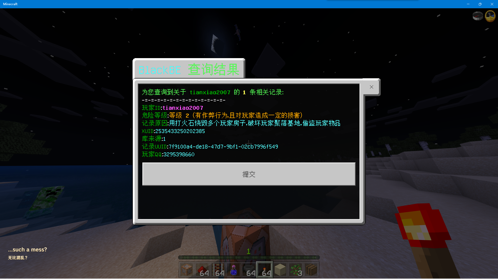
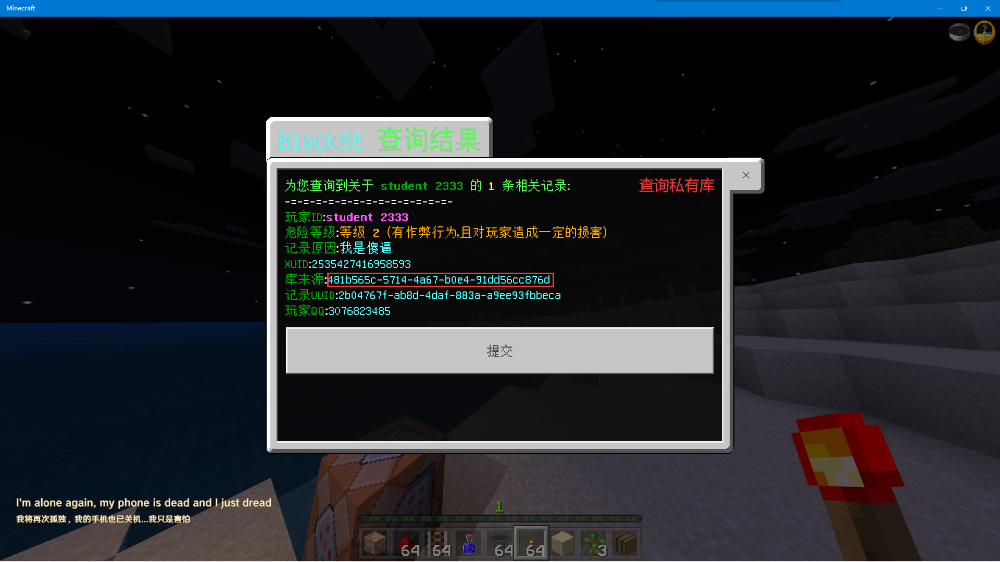

# BlackBE

Version: 3.0.0

Author: [student_2333](https://github.com/lgc2333)

BlackBE站长：Nyan-Cat [云黑官网](https://blackbe.xyz) [赞助云黑](https://afdian.net/@BlackBE)

插件需求
--

- 编写所用PYR版本：1.9.6

- 需要安装插件 [`PkgHelper`](../PkgHelper)

插件介绍
--
**本插件对接 BlackBE OpenAPI 3.0 实现插件所有功能**

- 本插件可以将已在公有库或你的私有库有违规记录的玩家踢出服务器并进行全服通报

  *_踢出服务器时显示的文本可以自定义_

  

  

- 本插件可以实现在服务器内查询公有库或你的私有库的违规记录
  

  

  

初次使用
--

- 查询云黑记录指令格式：`/blackbe <XboxID/QQ号/XUID>`
- 在初次使用本插件时，插件会在开服时通过[`PkgHelper`](../PkgHelper)安装本插件所需的第三方库以及在插件目录生成`blackbe.json`配置文件

  更改配置文件后**重启BDS**才能使新的配置生效

  这里是默认配置文件，请按需求以及下面的注释更改
  ```json
  {
    "token": "", //如果需要查询私有库，请将你BlackBE用户中心的OpenAPI Token填写在这里，如无需则留空
    "kick_message": "§c你TNND之前作过案上云黑了还想进服？" //自定义玩家被踢出服务器时显示的文本
  }
  ```

安装方法
--

- 将 `blackbe.py` 和 `blackbe_api.py` 文件放入 `BDS根目录/plugins/py` 文件夹内

更新日志
--
2022.2.5 更新3.0.0版本
